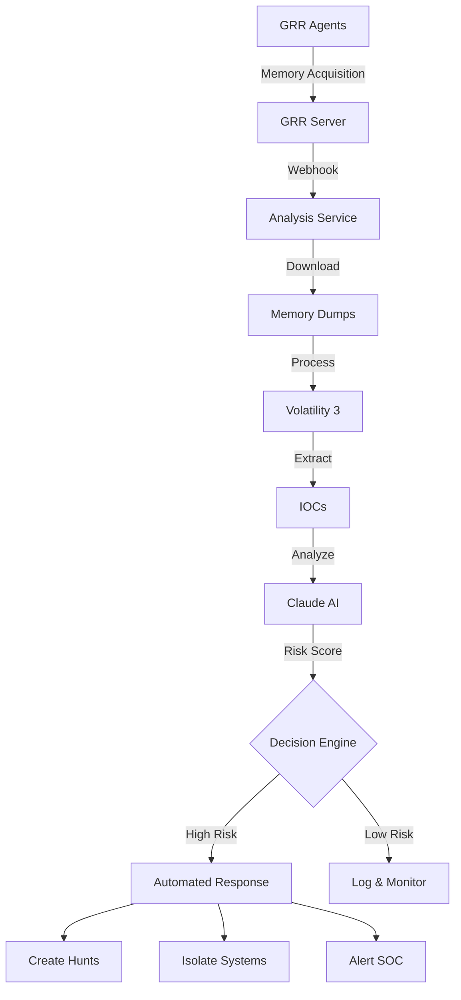

# Incident Response Agent: Automated Memory Forensics & IOC Analysis

An AI-powered incident response system that automatically analyzes memory dumps, extracts IOCs, and provides actionable threat intelligence using Claude AI. or new https://developers.googleblog.com/en/introducing-gemma-3n-developer-guide/

Been using claude code as UNIX utility to pipe logs like unix utility
```
get-gcp-logs 1uhd832d |
claude -p "correlate errors + commits" \
--output-format=json |
jq '. result'
```

https://gist.github.com/bigsnarfdude/3b83f0135c0e5639e77dc49b9806cc3d


```
GRR Remote Collection → Memory Dump → Volatility Analysis → IOC Extraction → Claude AI Analysis → Automated Response
```

## 🎯 Key Features

- **Automated Memory Analysis**: GRR webhook triggers automatic processing
- **IOC Extraction**: Identifies suspicious processes, network connections, and code injections
- **AI-Powered Threat Assessment**: Claude analyzes findings and provides risk scores
- **Automated Response**: High-risk detections trigger hunts and containment actions
- **Scalable Architecture**: Queue-based processing handles multiple incidents

## 🏗️ Architecture Overview



## 📋 Implementation Plan

### Phase 1: Infrastructure Setup (Week 1)
- [ ] Deploy GRR server and configure API access
- [ ] Install GRR agents on target systems
- [ ] Set up analysis server with Volatility 3
- [ ] Configure network connectivity and firewall rules

### Phase 2: Integration Development (Week 2)
- [ ] Deploy `grr_memory_analyzer.py` service
- [ ] Configure GRR webhooks for flow completion
- [ ] Test Volatility plugin execution
- [ ] Verify Claude AI integration

### Phase 3: Automation & Testing (Week 3)
- [ ] Create GRR hunt artifacts for common threats
- [ ] Test end-to-end workflow with sample malware
- [ ] Tune IOC extraction rules
- [ ] Calibrate risk scoring thresholds

### Phase 4: Production Deployment (Week 4)
- [ ] Create systemd service for analyzer
- [ ] Implement monitoring and alerting
- [ ] Integrate with SIEM/SOAR platforms
- [ ] Document runbooks and procedures

## 🚀 Quick Start

### Prerequisites
- Python 3.9+
- GRR server (3.4.5+)
- Volatility 3
- Claude API access (via Ollama or Anthropic API)

### Installation

1. **Clone the repository**
```bash
git clone https://github.com/yourusername/incident-response-agent.git
cd incident-response-agent
```

2. **Install dependencies**
```bash
pip install -e .
```

3. **Configure environment**
```bash
export GRR_API_ENDPOINT="http://grr-server:8000"
export GRR_USERNAME="admin"
export GRR_PASSWORD="your-password"
export VOLATILITY_PATH="/usr/local/bin/volatility3"
```

4. **Start the analyzer service**
```bash
python grr_memory_analyzer.py
```

## 🔧 Configuration

### GRR Webhook Setup
```bash
# Configure GRR to send webhooks on flow completion
grr_config_updater set Webhooks.flow_completions_url http://analyzer:8080/grr/webhook
```

### Volatility Plugins
The system automatically runs these plugins:
- `windows.info` - System information
- `windows.pslist` - Process listing
- `windows.netscan` - Network connections
- `windows.malfind` - Injected code detection
- `windows.cmdline` - Command line arguments

### Risk Scoring
- **0-30**: Low risk - Normal activity
- **31-69**: Medium risk - Suspicious activity requiring investigation
- **70-100**: High risk - Active compromise, immediate action required

## 📊 API Endpoints

- `POST /grr/webhook` - Receives GRR flow notifications
- `GET /analysis/status/{analysis_id}` - Check analysis results

## 🛡️ Security Considerations

- All memory dumps are processed in isolated environments
- API communications use authentication
- Sensitive data is not logged
- Analysis results are stored encrypted

## 🤝 Contributing

1. Fork the repository
2. Create a feature branch
3. Commit your changes
4. Push to the branch
5. Create a Pull Request

## 📝 License

MIT License - See LICENSE file for details

## 🔗 Resources

- [GRR Documentation](https://grr-doc.readthedocs.io/)
- [Volatility 3 Documentation](https://volatility3.readthedocs.io/)
- [Claude AI Documentation](https://docs.anthropic.com/)
- [Memory Forensics Cheat Sheet](https://github.com/volatilityfoundation/volatility/wiki/Command-Reference)
